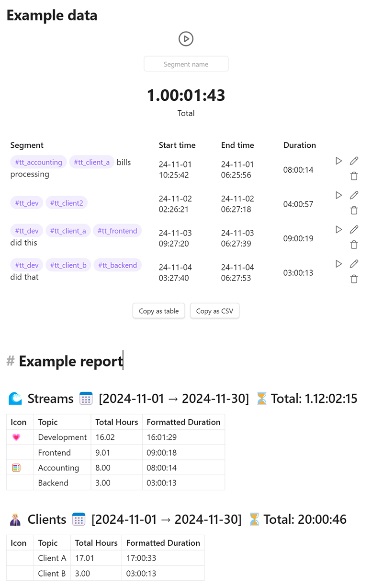

# Super Simple Time Tracker
Multi-purpose time trackers for your notes!


# 🤔 Usage
To get started tracking your time with Super Simple Time Tracker, open up the note that you want to track your time in. Move the cursor to the area you want the tracker to reside in, and then open your command palette and execute the `Super Simple Time Tracker: Insert Time Tracker` command.

When switching to live preview or reading mode, you will now see the time tracker you just inserted! Now, simply name the first segment (or leave the box empty if you don't want to name it) and press the **Start** button. Once you're done with the thing you were doing, simply press the **End** button and the time you spent will be saved and displayed to you in the table.

Need help using the plugin? Feel free to join the Discord server!

[](https://link.ellpeck.de/discordweb)

## 🔍 Tracker Data in Dataview
Super Simple Time Tracker has a public API that can be used with [Dataview](https://blacksmithgu.github.io/obsidian-dataview/), specifically [DataviewJS](https://blacksmithgu.github.io/obsidian-dataview/api/intro/), which can be accessed using the following code:

```js
dv.app.plugins.plugins["simple-time-tracker"].api;
```

The following is a short example that uses DataviewJS to load all trackers in the vault and print the total duration of each tracker. You can also find this example in action [in the test vault](https://github.com/Ellpeck/ObsidianSimpleTimeTracker/blob/master/test-vault/dataview-test.md?plain=1).

```js
// get the time tracker plugin api instance
let api = dv.app.plugins.plugins["simple-time-tracker"].api;

for (let page of dv.pages()) {
    // load trackers in the file with the given path
    let trackers = await api.loadAllTrackers(page.file.path);

    if (trackers.length)
        dv.el("strong", "Trackers in " + page.file.name);

    for (let { section, tracker } of trackers) {
        // print the total duration of the tracker
        let duration = api.getTotalDuration(tracker.entries);
        dv.el("p", api.formatDuration(duration));
    }
}
```

A full list of the functions exposed through the API can be found [in the code](https://github.com/Ellpeck/ObsidianSimpleTimeTracker/blob/master/src/main.ts#L8-L16). Proper documentation for the API will be added in the future.

# 👀 What it does
A time tracker is really just a special code block that stores information about the times you pressed the Start and End buttons on. Since time is tracked solely through timestamps, you can switch notes, close Obsidian or even shut down your device completely while the tracker is running! Once you come back, your time tracker will still be running.

The tracker's information is stored in the code block as JSON data. The names, start times and end times of each segment are stored. They're displayed neatly in the code block in preview or reading mode.

# Tim Tracking Summary / Reporting

1. **Time Tracking Entries with Tags**: Track work sessions with tags to categorize different activities.
    
    - Example of an entry: `#tt_dev #tt_client_a #tt_frontend` represents time spent working on the development (frontend) for a specific client.
        
2. **Enhanced Reporting Functionality**: Generate time tracking reports for specific time periods, allowing detailed insight into how time was allocated.
    
    - **Stream-based Reports**: View summaries of time based on specific streams such as Development, Accounting, etc.
        
    - **Client-based Reports**: Track hours spent working for specific clients.
        



The output within Obsidian will render detailed information for each time segment, as shown in the first image.

## Example Report

Call command  `Ctrl+P` select `Insert Time Tracking Summary`

The reporting capability allows generating summaries for specific time ranges and topics:

- **Streams Report**: A summary of all topics (e.g., Development, Accounting) over a selected period.
    
    ```
    time-tracking-summary
        "2024-11-01", "2024-11-30" 
    ```
    
- **Clients Report**: A summary for individual topic over a given time range.
    
    ```
    time-tracking-summary
        "2024-11-01", "2024-11-30", clients
    ```
    

These examples help demonstrate how you can leverage the new tracking and reporting capabilities.

## How to Use

1. **Tag Configuration**    
    - Configure your tags, icons, and sub tags using YAML in the settings of the plugin.        
    - Example configuration can be found in the settings:
2. **Tag your records with one or more tags / sub tags**
3. **Inserting Time Tracking Summary**    
    - Use the newly added command to insert the time tracking summary snippet into a markdown file.        
    - This will generate a report for a given period, optionally filtered by a specific topic.
        
```yaml
# You can have as many 'sections' as you want to track different domains separately or in parallel

# Example secction / topic 1
streams:
  name: "🌊 Streams"
  items:
    - topic: "Accounting"
      icon: "🧮"
      tag: "#tt_accounting"
      subTags: []

    - topic: "Development"
      icon: "💗"
      tag: "#tt_dev"
      subTags:
        - topic: "Frontend"
          tag: "#tt_frontend"
          subTags: []

        - topic: "Backend"
          tag: "#tt_backend"
          subTags: []

# Example section / topic 2
clients: 
  name: "👨🏼‍💼 Clients"
  items:
    - topic: "Client A"
      tag: "#tt_client_a"
      subTags: []

    - topic: "Client B"
      tag: "#tt_client_b"
      subTags: []`

```
        

        
# 🙏 Acknowledgements
If you like this plugin and want to support its development, you can do so through my website by clicking this fancy image!

[](https://ellpeck.de/support)
